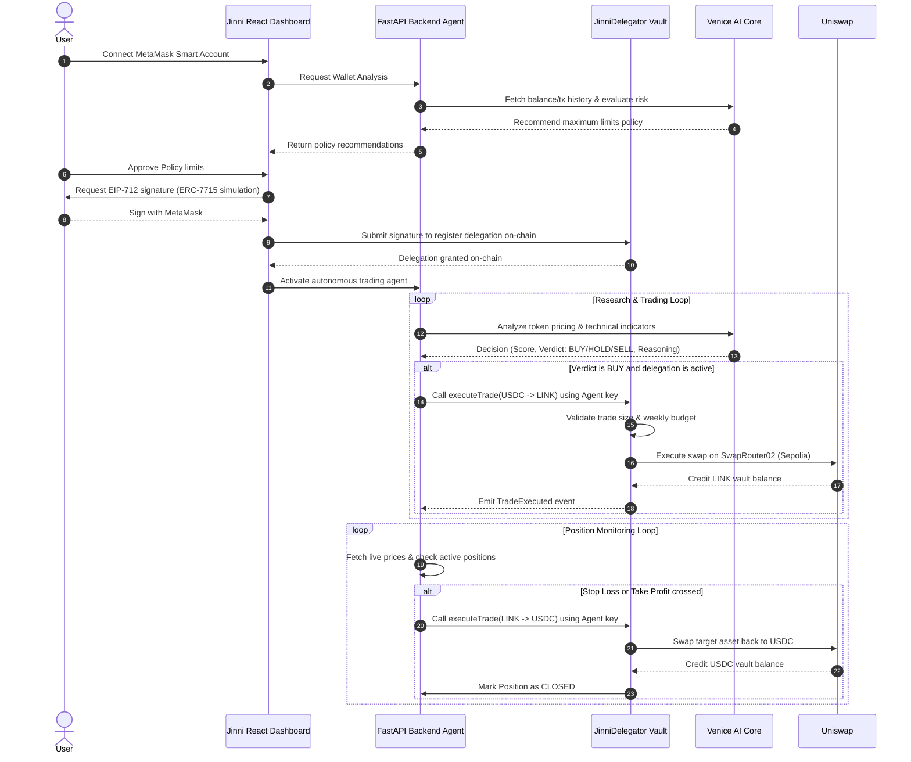

# Jinni 🧞 | Autonomous Wallet Agent

Jinni is a complete, real, verifiable autonomous DeFi agent platform built for Ethereum Sepolia. It allows users to safely delegate transaction rights (using EIP-7710/7715 principles) to an AI agent, which handles market research, analyzes risk boundaries, executes trades, and monitors positions within user-approved limits.

---

## 🚀 Key Features

* **MetaMask Permission Granting**: User signs a one-time EIP-712 permission structure specifying trade limits, budget boundaries, and expiry.
* **Venice AI Reasoning Core**: Uses Llama models via Venice AI to evaluate wallet risk boundaries and perform technical asset analysis.
* **Non-Custodial On-Chain Trading**: User deposits testing funds into a vault contract. The agent can ONLY execute trades within the contract and cannot withdraw funds.
* **Automatic Monitoring & Exit Loop**: Continuous background monitoring loop evaluates profit/loss, automatically executing exits if Stop Loss or Take Profit levels are crossed.
* **Built-in test token faucet**: Users can mint 1,000 units of USDC, LINK, or UNI directly on Sepolia from the dashboard.

---

## 📐 System Architecture

### Sequence Flow



---

## ⛓️ Deployed Contracts (Sepolia)

* **JinniDelegator Vault**: `0x5462D420CEf200c8704Db6b48BE9Db3A000A231C`
* **Test USDC Token**: `0x1c7D4B196Cb0C7B01d743Fbc6116a902379C7238`
* **Test LINK Token**: `0x779877A7B0D9E8603169DdbD7836e478b4624789`
* **Test UNI Token**: `0x1f9840a85d5aF5bf1D1762F925BDADdC4201F984`
* **Uniswap V3 Router02**: `0x3bFA4769FB09eefC5a80d6E87c3B9C650f7Ae48E`

---

## 🛠️ Project Setup

### Prerequisites
* Python 3.10+
* Node.js v18+ & `pnpm`
* MetaMask installed in your browser

---

### 1. Backend Setup

1. Navigate to the backend directory:
   ```bash
   cd backend
   ```
2. Install Python dependencies:
   ```bash
   pip install -r requirements.txt
   ```
3. Create a `.env` file from the template:
   ```bash
   cp .env.example .env
   ```
4. Edit the `.env` file and configure:
   * `VENICE_API_KEY`: Get one from [Venice AI Console](https://venice.ai).
   * `AGENT_PRIVATE_KEY`: Private key of the EOA delegate agent address. Needs a tiny bit of Sepolia ETH to submit transactions.
   * `SEPOLIA_RPC_URL`: RPC endpoint (e.g. Infura, Ankr, Alchemy).
5. Start the FastAPI server:
   ```bash
   python main.py
   ```
   The backend will be running at `http://localhost:8000`.

---

### 2. Frontend Setup

1. Navigate to the frontend directory:
   ```bash
   cd ../frontend
   ```
2. Install Node packages:
   ```bash
   pnpm install
   ```
3. Run the development server:
   ```bash
   pnpm dev
   ```
   Open `http://localhost:5173` in your browser.

---

## 💡 How to Test the Flow

1. **Connect MetaMask**: Click **Connect Wallet** in the top right. Switch your network to **Ethereum Sepolia**.
2. **Claim Test Tokens**: In the **Sepolia Test Faucet** panel, click **Claim USDC**. This will mint test USDC directly to your wallet on-chain.
3. **Deposit to Vault**: Select `USDC` in the **Agent Trading Vault** panel, type an amount (e.g. `20`), and click **Deposit to Vault**. Confirm the transaction in MetaMask.
4. **AI Policy recommendation**: Click **Analyze Wallet Risk (Venice AI)**. The Wallet Analysis Agent will review your Sepolia balance and suggest spending limits.
5. **Approve Limits & Sign EIP-712**: Click **Approve Policy & Sign EIP-712**. Sign the typed permission request in MetaMask. This registers the agent's delegation status.
6. **DeFi Research**: Type a token symbol (like `LINK` or `UNI`) in the **DeFi Research Agent** console and click **Score Token**. The Research Agent will fetch real-time indicators and Venice AI will provide a scoring verdict.
7. **Trigger Agent Trade**: If the verdict is `BUY`, click **Execute Agent Swap**. The agent will submit the transaction to Sepolia using the delegation contract.
8. **Position Exit**: The backend monitoring agent will periodically check the position. If the price reaches the Stop Loss or Take Profit targets, it will autonomously sell and close the position on-chain.
