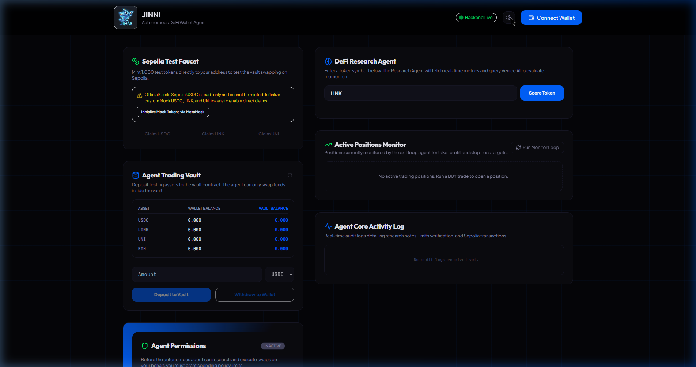
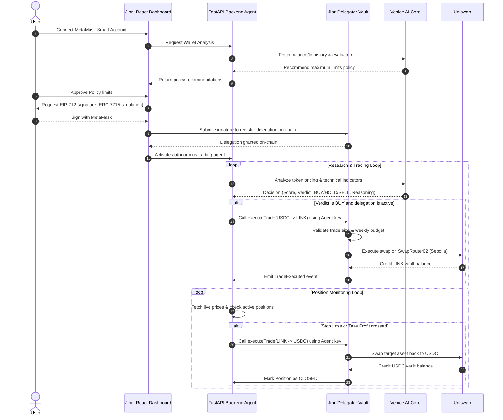

# 🧞 JINNI — Autonomous DeFi Wallet Agent

> 🎯 Built for the MetaMask Smart Accounts x Venice AI Hackathon

<div align="center">
  
  <h3>Autonomous Agentic DeFi Wallet Layer</h3>
  <p>Delegated execution powered by Venice AI, MetaMask EIP-712 permissions, and ERC-7710/7715 architectures.</p>

  [](https://jinni-omega.vercel.app/)
  [](https://sepolia.etherscan.io/)
  [](https://venice.ai/)
  [](./LICENSE)
</div>

---

## 🔗 Live Resources

* **Live Frontend**: [https://jinni-omega.vercel.app/](https://jinni-omega.vercel.app/)
* **Live Backend API**: [https://jinni-6wfe.onrender.com/api/status](https://jinni-6wfe.onrender.com/api/status)
* **Demo Video**: [https://youtu.be/skp-PdfZ4Ko](https://youtu.be/skp-PdfZ4Ko)
* **X (Twitter) Profile**: [https://x.com/JinniAgent](https://x.com/JinniAgent)
* **Launch Post**: [https://x.com/JinniAgent/status/2066420765499801732](https://x.com/JinniAgent/status/2066420765499801732)

---

## 🎨 Platform Dashboard



---

## 🏆 Hackathon Track Mapping

| Track / Integration | Technology Used | Implementation Details & Code Files |
| :--- | :--- | :--- |
| **MetaMask & EIP-712 Delegations** | MetaMask EIP-712 Signatures | Users sign typed spending limits securely via MetaMask, simulating non-custodial session authorization and EIP-7715 keys. <br> 📄 See [`frontend/src/lib/web3.ts`](./frontend/src/lib/web3.ts) |
| **Venice AI Reasoning Core** | Llama-3.3-70b Inference | Evaluates user wallet history, recommends safe daily risk limits, and scores tokens to execute swaps autonomously. <br> 📄 See [`backend/agents.py`](./backend/agents.py) |
| **ERC-7715 / Permissioning** | On-Chain Delegated Permissions | Restricts agent actions to specific assets, trade sizes, and expiration limits verified directly inside smart contracts. <br> 📄 See [`contracts/JinniDelegator.sol`](./contracts/JinniDelegator.sol) |
| **ERC-7710 / Delegations** | Non-Custodial Vault Swapping | Ensures the agent EOA can only interact within user-deposited vault parameters and has zero rights to withdraw funds. <br> 📄 See [`contracts/JinniDelegator.sol`](./contracts/JinniDelegator.sol) |

---

## 🚀 Key Features

* **AI-Generated Risk Policy**: Venice AI checks your wallet holdings and recommends trade sizes, weekly limits, and duration bounds.
* **On-Chain Session Signatures**: EIP-712 session approvals register agent spending limits on-chain, keeping you in full control.
* **Non-Custodial Escrow Vault**: Users deposit Sepolia ETH, USDC, LINK, or UNI. The agent swaps inside the Uniswap V3 Pool but can never extract funds.
* **Position Monitoring Agent**: Evaluates active vault swaps with automated exit logic (Stop Loss & Take Profit thresholds).
* **Built-in Sepolia Faucet**: Mint Mock USDC, LINK, or UNI directly on-chain through the dashboard.

---

## 📐 System Architecture & Flow



---

## ⛓️ Deployed Contracts (Sepolia Network)

* **JinniDelegator Vault**: [`0x5462D420CEf200c8704Db6b48BE9Db3A000A231C`](https://sepolia.etherscan.io/address/0x5462D420CEf200c8704Db6b48BE9Db3A000A231C)
* **Test USDC Token**: [`0x1c7D4B196Cb0C7B01d743Fbc6116a902379C7238`](https://sepolia.etherscan.io/address/0x1c7D4B196Cb0C7B01d743Fbc6116a902379C7238)
* **Test LINK Token**: [`0x779877A7B0D9E8603169DdbD7836e478b4624789`](https://sepolia.etherscan.io/address/0x779877A7B0D9E8603169DdbD7836e478b4624789)
* **Test UNI Token**: [`0x1f9840a85d5aF5bf1D1762F925BDADdC4201F984`](https://sepolia.etherscan.io/address/0x1f9840a85d5aF5bf1D1762F925BDADdC4201F984)
* **Uniswap V3 Router02**: `0x3bFA4769FB09eefC5a80d6E87c3B9C650f7Ae48E`

---

## 🛠️ Installation & Setup

### Prerequisites
* **Python 3.10+** (Backend)
* **Node.js v18+** & `pnpm` (Frontend)
* **MetaMask browser extension** (Sepolia network)

### 1. Backend Setup

1. Navigate to the backend directory:
   ```bash
   cd backend
   ```
2. Install dependencies:
   ```bash
   pip install -r requirements.txt
   ```
3. Create environment variables:
   ```bash
   cp .env.example .env
   ```
4. Configure your `.env` values (Venice API Key, RPC URL, and Agent private key).
5. Run the server:
   ```bash
   python main.py
   ```
   Backend runs at `http://localhost:8000`.

### 2. Frontend Setup

1. Navigate to the frontend directory:
   ```bash
   cd ../frontend
   ```
2. Install packages:
   ```bash
   pnpm install
   ```
3. Start the Vite server:
   ```bash
   pnpm dev
   ```
   Frontend runs at `http://localhost:5173`.

---

## 💡 Step-by-Step Test Guide

1. **Connect MetaMask**: Click **Connect Wallet** (top-right) and switch your network to **Sepolia**.
2. **Mock Token setup**: Click **Setup Local Test Environment** in the faucet card to register/deploy the testing tokens inside MetaMask.
3. **Mint USDC**: Click **Claim USDC** to mint 1,000 mock USDC for testing.
4. **Deposit to Vault**: Select `USDC` in the **Agent Trading Vault** panel, input `25`, and click **Deposit to Vault**.
5. **Analyze Wallet**: Click **Analyze Wallet Risk (Venice AI)**. The agent will read your Sepolia balances and generate a custom trading limit policy.
6. **Grant Permissions**: Click **Approve Policy & Sign EIP-712**. Sign the signature request inside MetaMask.
7. **DeFi Research**: Type a token symbol (e.g. `LINK` or `UNI`) in the **DeFi Research Agent** box and click **Score Token** to get AI evaluation.
8. **Trade**: If the AI returns a `BUY` verdict, click **Execute Agent Swap** to execute the trade autonomously using the agent.
9. **Exit Monitoring**: The position will load under **Active Positions Monitor**. The background exit loops will automatically execute a sell swap if Take Profit or Stop Loss thresholds are hit.

---

## ✉️ Outreach / DM Template

If you want to reach out to builders, mentors, or judges, use this template:

```markdown
Hi 👋

I just completed my hackathon project JINNI — Autonomous DeFi Wallet Agent.

JINNI combines:
* MetaMask Smart Accounts
* ERC-7715 Permissions
* ERC-7710 Delegations
* Venice AI

Users can connect their wallet, set spending limits, grant permissions, and allow an AI agent to research and execute actions within those limits while remaining fully in control.

### Demo Video
https://youtu.be/skp-PdfZ4Ko

### GitHub
https://github.com/YousufAziz1/jinni

### X Profile
https://x.com/JinniAgent

### Launch Post
https://x.com/JinniAgent/status/2066420765499801732

Current features:
✅ Wallet Connection
✅ Agent Permissions
✅ Venice AI Research Agent
✅ Trading Vault
✅ Activity Logs
✅ Position Monitoring UI
✅ Sepolia Test Environment

I'm currently polishing the final submission.

I'd really appreciate any feedback on:
* Missing features
* UX improvements
* Hackathon judging perspective
* Documentation gaps

Thanks for taking a look! 🙏
```

---

*Built with ❤️ for the Hackathon by Yousuf.*
